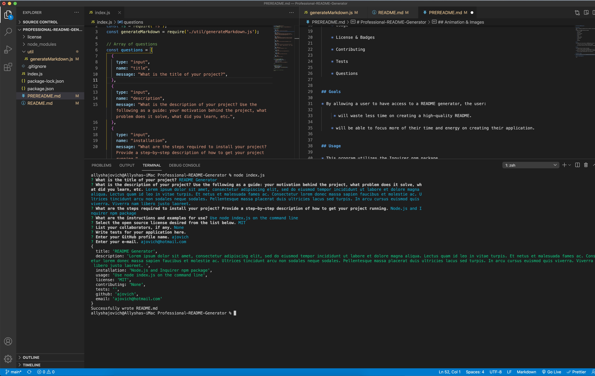
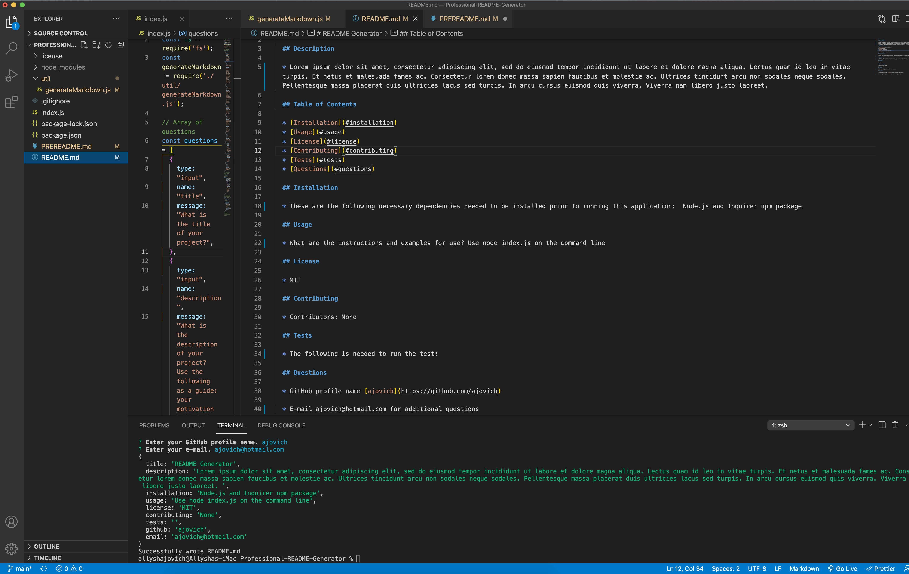

# Professional-README-Generator

## Description

* This is a command-line application that will generate a professional README.md file from a user's input.

* Prompts for the README include the following:

    * Title of Project

    * Description

    * Table of Contents

    * Installation

    * Usage

    * License & Badges

    * Contributing

    * Tests

    * Questions

## Goals

* By allowing a user to have access to a README generator, the user:

     * will waste less time on creating a high-quality README.

    * will be able to focus more of their time and energy on creating their application. 

## Usage

* This program utilizes the Inquirer npm package. 

    * Click [here](https://www.npmjs.com/package/inquirer) to go to npmjs.com/package/inquirer

* In order to run this application, please ensure node.js is downloaded. 

    * Click [here](https://nodejs.org/en/) to go to nodejs.org 

## Animation & Images

* https://drive.google.com/file/d/15rm6ya5ubE9q_nNEldPOChx0W7FQyKsR/view

## Link to GitHub Repository

* https://ajovich.github.io/Professional-README-Generator/
* https://github.com/ajovich/Professional-README-Generator